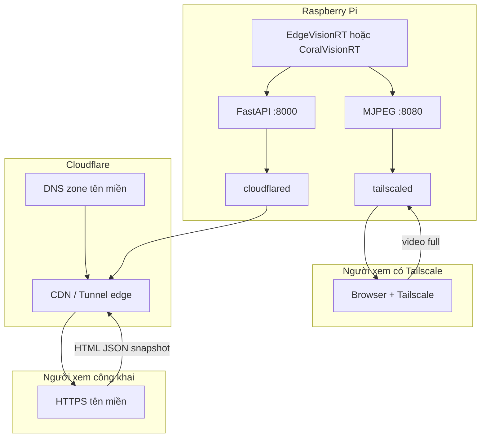

# Báo cáo kiến trúc hệ thống Edge AI — EdgeVisionRT, CoralVisionRT, Dashboard & truy cập từ xa

Tài liệu tổng hợp kiến trúc phần mềm, pipeline suy luận, hiển thị cục bộ (LCD/framebuffer), camera (V4L2), tối ưu C++/NCNN, dashboard web, tên miền, Cloudflare Tunnel và Tailscale. Phạm vi tham chiếu mã nguồn: [EdgeVisionRT](.) (C++), [CoralVisionRT](../CoralVisionRT) (Python + Google Coral Edge TPU), [Dashboard](../CoralVisionRT/Dashboard/Dashboard-Detection-main) (FastAPI), [REMOTE_ACCESS](../CoralVisionRT/REMOTE_ACCESS.md).

---

## 1. Mục tiêu hệ thống

- **Cạnh biên (Raspberry Pi)**: thu hình từ camera, chạy YOLO phát hiện đối tượng với độ trễ thấp, hiển thị kết quả lên **LCD qua framebuffer** (`/dev/fb0`), đồng thời có thể **đẩy metric / snapshot / MJPEG** lên **dashboard HTTP**.
- **Giám sát từ xa**: người dùng mở **HTTPS** qua **tên miền** (Cloudflare) xem metric và ảnh snapshot; người có **Tailscale** xem thêm **video MJPEG** chất lượng cao qua VPN lớp 3.

---

## 2. Hai nhánh triển khai inference trên Pi

| Tiêu chí | EdgeVisionRT (C++) | CoralVisionRT (Python) |
|-----------|-------------------|------------------------|
| **Runtime** | NCNN, tối ưu CPU ARM64 | TensorFlow Lite + **Google Coral Edge TPU** |
| **Camera** | **V4L2** mmap, ưu tiên `YUYV` ([`input_pipeline.cpp`](src/input_pipeline.cpp)) | OpenCV `VideoCapture` ([`camera_worker.py`](../CoralVisionRT/src/camera_worker.py)) |
| **Hiển thị LCD** | Ghi trực tiếp **framebuffer** RGB565/BGRA ([`drm_display.h`](include/drm_display.h)) | `DisplayWorker` → `/dev/fb0` RGB565 ([`display_worker.py`](../CoralVisionRT/src/display_worker.py)) |
| **Tối ưu** | Assembly NEON, transpose, governor, affinity ([`README.md`](README.md)) | Luồng đa luồng camera / infer / hiển thị; suy luận trên TPU |
| **Dashboard** | `DashboardClient` C++ + `httplib` ([`dashboard_client.cpp`](src/dashboard_client.cpp)) | `DashboardClient` Python + `requests` ([`dashboard_client.py`](../CoralVisionRT/src/dashboard_client.py)) |
| **MJPEG** | `mjpeg_stream_server.cpp` (tích hợp trong binary) | `ThreadingHTTPServer` trong [`main.py`](../CoralVisionRT/src/main.py) |

Hai nhánh **cùng giao tiếp** với một **API dashboard** (FastAPI) qua HTTP cục bộ hoặc qua mạng.

---

## 3. Pipeline EdgeVisionRT (chi tiết kỹ thuật)

### 3.1. Đầu vào camera — V4L2

- File: [`src/input_pipeline.cpp`](src/input_pipeline.cpp).
- **V4L2** với `VIDIOC_QUERYCAP`, `VIDIOC_S_FMT` (định dạng **`V4L2_PIX_FMT_YUYV`**), `VIDIOC_REQBUFS` + **mmap** để giảm copy bộ nhớ.
- Luồng tệp video: OpenCV `VideoCapture` (đường khác, cùng interface `FrameBuffer` cho downstream).
- Mục tiêu: đồng bộ định dạng đầu ra cho preprocess + NCNN.

### 3.2. Suy luận — NCNN + tối ưu

- [`src/inference_engine.cpp`](src/inference_engine.cpp), [`src/postprocess.cpp`](src/postprocess.cpp).
- Model dạng **NCNN** (`.param` / `.bin`), hỗ trợ FP32 / FP16 / **INT8** (lựa chọn qua [`run.sh`](run.sh)).
- **Tối ưu README**: kernel assembly ARM64 (`asm_kernels.S`), transpose output YOLOv8, memcpy NEON; **governor performance**, **ghim luồng** (infer vs display) để giảm jitter.
- README benchmark hướng tới **Raspberry Pi 5** (Cortex-A76); trên Pi 4 số FPS thấp hơn nhưng **kiến trúc pipeline tương tự**.

### 3.3. Hiển thị — Framebuffer (`/dev/fb0`)

- Header: [`include/drm_display.h`](include/drm_display.h) — mô tả **DRM/KMS framebuffer**, không qua X11/Wayland.
- Scale full màn hình (nearest-neighbor), **RGB565** hoặc **BGRA**, vẽ bbox theo lớp, font 8×8 nhúng, nhãn class + confidence.
- **Ưu điểm**: độ trễ hiển thị thấp, phù hợp kiosk / môi trường không desktop.
- **Điều kiện vận hành**: thường `sudo systemctl stop lightdm` và `chmod 666 /dev/fb0` (trong [`run_721_M4_BaoLong.sh`](run_721_M4_BaoLong.sh)).

### 3.4. Servo (tùy chọn)

- [`run_721_M4_BaoLong.sh`](run_721_M4_BaoLong.sh): export PWM `pwmchip0`, GPIO 12 (overlay trong `/boot/config.txt`).
- Ứng dụng có chế độ `servo` trong [`run.sh`](run.sh) — điều khiển phần cứng ngoài suy luận.

### 3.5. Dashboard & MJPEG (C++)

- [`dashboard_client.cpp`](src/dashboard_client.cpp): thread hàng đợi, POST JSON **`/metrics`**, **`/boxes`**, đăng ký **`/stream-config`** với URL MJPEG; có thể gửi snapshot (tùy bản build).
- [`mjpeg_stream_server.cpp`](src/mjpeg_stream_server.cpp): phục vụ luồng MJPEG (cổng cấu hình, thường 8080).
- [`run.sh`](run.sh): cờ `dashboard` bật gửi dữ liệu lên `http://127.0.0.1:8000` (hoặc biến môi trường tương đương nếu được chỉnh).

---

## 4. Pipeline CoralVisionRT (Python + Edge TPU)

- [`main.py`](../CoralVisionRT/src/main.py): `InferWorker` (TFLite Edge TPU), `CameraWorker`, `DisplayWorker`, tùy chọn **MJPEG** cổng 8080, `DashboardClient`.
- Metric: FPS mượt, thời gian suy luận (ms), nhiệt độ CPU (`/sys/...` hoặc `vcgencmd`), CPU/RAM (`psutil`), `detect_count`, `camera_status`.
- **Snapshot ~1 Hz**: JPEG đã vẽ bbox → POST multipart **`/snapshot`** cho người xem **không** có Tailscale.
- **`--tailscale-ip`**: đăng ký `http://100.x.x.x:8080/stream` để frontend biết URL video đầy đủ qua Tailscale.

---

## 5. Dashboard web (FastAPI)

- Thư mục: [`Dashboard/Dashboard-Detection-main`](../CoralVisionRT/Dashboard/Dashboard-Detection-main).
- **Stack**: FastAPI, Uvicorn, SQLAlchemy, **SQLite** (`metrics.db`), static HTML/JS/Chart.js.
- **API chính**:
  - `POST /metrics` — lưu bản ghi thời gian (FPS, latency, nhiệt độ, …).
  - `GET /latest`, `GET /timeseries`, `GET /history` — phục vụ biểu đồ.
  - `POST/GET /boxes` — bbox TXT mới nhất (RAM).
  - `POST/GET /stream-config` — URL MJPEG (ưu tiên IP Tailscale).
  - `POST /snapshot`, `GET /snapshot.jpg` — ảnh JPEG công khai qua Cloudflare.
- **Systemd**: `coralvision-dashboard@<user>` — lắng nghe **`127.0.0.1:8000`** (chỉ localhost; Internet vào qua tunnel).

---

## 6. Kiến trúc mạng: tên miền, Cloudflare, Tailscale

### 6.1. Tên miền (ví dụ `lvtn144.tech`)

- Domain thêm vào **Cloudflare**; **nameserver** tại registrar (.TECH / Namify) trỏ về **hai NS Cloudflare**.
- **Named tunnel**: `cloudflared tunnel create`, `cloudflared tunnel route dns <tên_tunnel> <hostname>` tạo **CNAME** tới `*.cfargotunnel.com` — **không** cần A record IPv4 máy nhà.
- **`config.yml`**: `tunnel` (UUID), `credentials-file`, `ingress` trỏ `hostname` → `http://127.0.0.1:8000`.
- **Systemd** `cloudflared-thesis@<user>`: phải chạy `cloudflared tunnel --config ... run`, **không** dùng `--url` (quick tunnel) nếu DNS đã gắn named tunnel — nếu không sẽ **Error 1033**.

### 6.2. Cloudflare Tunnel

- **Quick tunnel** (`--url`): URL `*.trycloudflare.com`, đổi khi restart `cloudflared`; không cần domain riêng.
- **Named tunnel**: URL cố định `https://<subdomain>.<domain>`; cần domain trên Cloudflare + `cert.pem` sau `cloudflared tunnel login`.

### 6.3. Tailscale

- **VPN mesh** (WireGuard), IP `100.x.x.x`.
- **Video MJPEG** (`:8080`): truy cập trực tiếp qua Tailscale — độ trễ thấp, không vướng điều khoản stream video trên gói Cloudflare Free cho traffic lớn.
- **Snapshot 1 Hz** qua HTTPS: đủ cho người không cài Tailscale.

---

## 7. Luồng dữ liệu tổng quát

1. **Camera** → preprocess → **YOLO** (NCNN hoặc Edge TPU).
2. **LCD**: framebuffer `/dev/fb0` (C++ hoặc Python).
3. **Dashboard**: POST metric / bbox / snapshot; GET từ browser qua **Cloudflare** tới `127.0.0.1:8000`.
4. **Video đầy đủ**: browser có Tailscale → `http://100.x.x.x:8080/stream`.

---

## 8. Khởi động sau khi bật nguồn Pi

| Thành phần | Tự động (systemd `enable`) | Chạy tay |
|------------|----------------------------|----------|
| `tailscaled` | Có | — |
| `coralvision-dashboard@user` | Có (khi đã setup) | — |
| `cloudflared-thesis@user` | Có | Phải dùng `config.yml` đúng named tunnel |
| EdgeVisionRT / CoralVisionRT inference | Không | `./run.sh ...` hoặc `bash GPU-Coral_721_M4_BL.sh` |

---

## 9. Tài liệu liên quan trong repo

- [EdgeVisionRT README](README.md) — benchmark, chế độ `cam fb`, tối ưu.
- [CoralVisionRT REMOTE_ACCESS.md](../CoralVisionRT/REMOTE_ACCESS.md) — setup Pi, tunnel, Tailscale, troubleshooting.
- [setup_remote_pi.sh](../CoralVisionRT/setup_remote_pi.sh) — venv dashboard, cloudflared, tailscale, systemd.

---

## 10. Kết luận

Hệ thống kết hợp **suy luận biên** (V4L2 + NCNN hoặc Coral TPU), **hiển thị tối thiểu độ trễ** (framebuffer), **dashboard tách lớp** (FastAPI + SQLite), và **xuất bản an toàn qua Internet** (HTTPS Cloudflare Tunnel trên tên miền riêng) kèm **video chất lượng cao qua Tailscale**. Việc phân tách **metric/snapshot (Cloudflare)** và **MJPEG đầy đủ (Tailscale)** cân bằng giữa khả năng truy cập công khai, tuân thủ dịch vụ và trải nghiệm xem realtime.

---

*Báo cáo này mô tả kiến trúc theo mã nguồn và cấu hình đã thống nhất trong repo; thông số FPS/nhiệt độ phụ thuộc phần cứng cụ thể (Pi 4/5, model, làm mát).*
